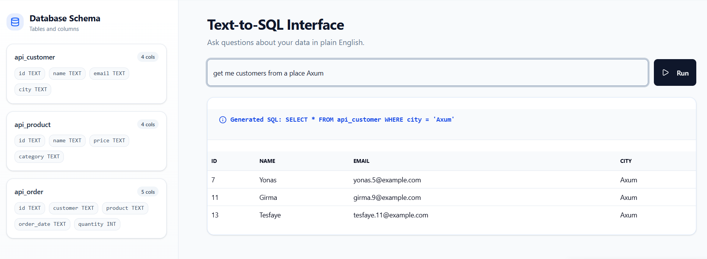

# Text-to-SQL System

Full-stack demo that turns natural language questions into SQL and executes them against a local database. The backend is Django, the frontend is Vite + React, and the Hugging Face Space hosts the text-to-SQL model UI.



## Prerequisites
- Python 3.11+
- pipenv
- Node.js 18+ (or Bun)
- Git

## Backend setup
```bash
cd backend
pipenv install
pipenv shell
python manage.py migrate
```

Create `backend/.env`:
```
DEBUG=True
DATABASE_URL=sqlite:///./text_to_sql_db.sqlite3
SECRET_KEY=your-secret-key
ALLOWED_HOSTS=127.0.0.1,localhost
CORS_ALLOW_ALL_ORIGINS=True
CORS_ALLOWED_ORIGINS=
HF_TOKEN=your-huggingface-token
HF_MODEL_ID=your-username/your-model-id
```

Initialize the database:
```bash
python manage.py migrate
```

Run the backend:
```bash
python manage.py runserver
```

Optional: seed mock data
```bash
python manage.py seed_mock_data
```

## Frontend setup
```bash
cd frontend
npm install
```

Ensure `frontend/.env.development`:
```
VITE_API_BASE_URL=http://127.0.0.1:8000/api
```

Run the frontend:
```bash
npm run dev
```

## Hugging Face Space setup (Gradio)
This app ships a simple Gradio Space under `hf_app/` with `app.py` and `requirements.txt`.

1) Create a new Space
- Go to https://huggingface.co/spaces
- New Space → SDK: Gradio → Python

2) Push the Space files
```bash
git clone https://huggingface.co/spaces/<your-username>/<your-space-name>
cd <your-space-name>
copy /Y ..\\path\\to\\text-to-sql-system\\hf_app\\app.py app.py
copy /Y ..\\path\\to\\text-to-sql-system\\hf_app\\requirements.txt requirements.txt
git add app.py requirements.txt
git commit -m "Add Gradio app"
git push
```

3) Verify the Space
- Wait for the build to complete
- Open the Space URL and try a sample prompt

